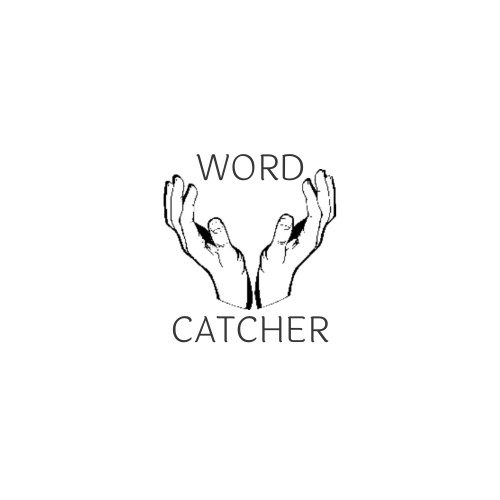
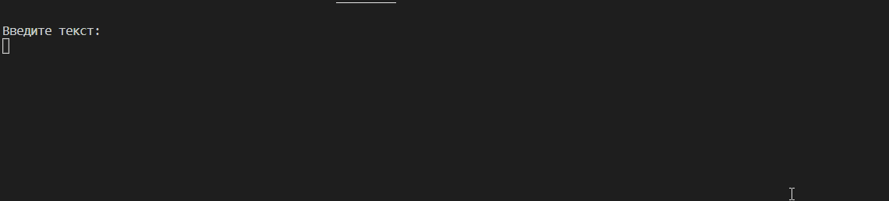
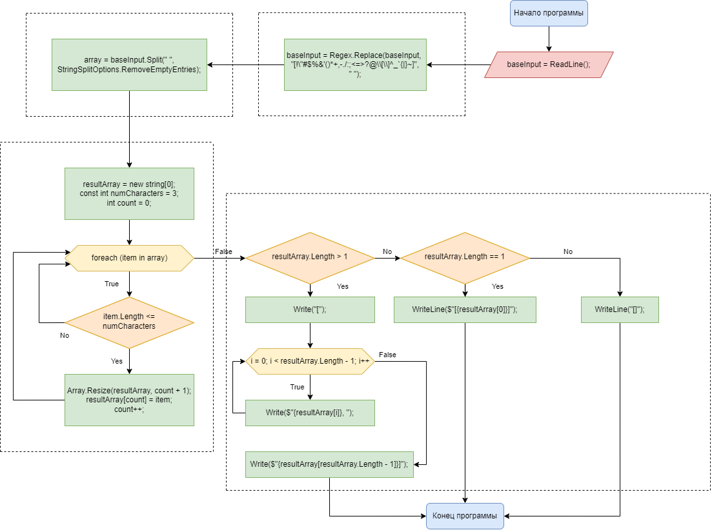

<h1 align="center">Word Catcher</h1>

## **Description**

Word Catcher implemented from scratch on C#. This is the final test work of the first block of the developer program at GeekBrains. First block of program including only base knowledge so don't expect too much from the source code xD.

## **About project**
As you can see in the gif, Word Catcher is a console application. The idea behind this program is simple. You enter some text and the program finds words in it consisting of 3 characters or less. Selected words are saved in a new array and displayed.
Since the selected words are saved in an array, you can also use this program for further work in large word processing projects. 

## **Technologies**
This program is written entirely in C# using the System.Text and System.Text.RegularExpressions libraries.

## **Project features**

The number of characters in a word to be extracted from the text is set as a constant and is equal to three. But also, if necessary, this parameter can be set by the user or transferred from another program.

## Project setup

Not provided

## Future scope

Not planned

## Support

If you liked this simple work you can write me something nice, I will be pleased.
